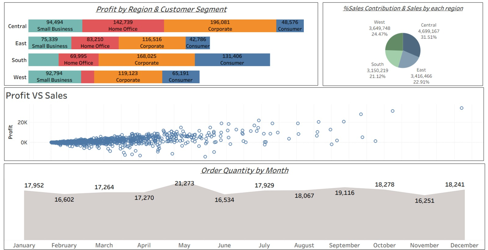

# 📊 Tableau Sales & Profit Analysis Dashboard

## 📌 Project Overview

This project presents an **interactive Tableau dashboard** designed to analyze business performance across different regions and customer segments.
The dashboard provides insights into **profit distribution, sales contribution, and order trends**, helping stakeholders make data-driven decisions.

---

## 🎯 Objectives

* Analyze **profit across regions and customer segments**
* Understand **sales contribution by region**
* Identify the relationship between **sales and profit**
* Track **monthly order quantity trends**

---

## 📈 Dashboard Insights

### 🔹 Profit by Region & Customer Segment

* The **Corporate segment** contributes the highest profit across most regions
* The **Central region** shows strong performance across all segments
* Variation in segment performance highlights targeted growth opportunities

### 🔹 Sales Contribution by Region

* **Central region** leads in total sales contribution
* Followed by **West and East regions**
* **South region** contributes the least, indicating potential for expansion

### 🔹 Profit vs Sales Analysis

* Positive correlation between **sales and profit**
* Some outliers indicate **high sales but low profit**, suggesting cost inefficiencies

### 🔹 Monthly Order Trends

* Peak order volume observed in **May and September**
* Slight dips in **February, June, and November**
* Overall stable demand with moderate fluctuations

---

## 🛠️ Tools & Technologies Used

* **Tableau** – Data visualization & dashboard creation
* **Excel / CSV Dataset** – Data source

---

## 📸 Dashboard Preview

---

## 🚀 Key Learnings

* Improved skills in **data visualization and storytelling**
* Learned how to analyze **multi-dimensional business data**
* Gained experience in building **interactive dashboards in Tableau**

---

## 📬 Contact

If you have any feedback or suggestions, feel free to connect with me!

---
